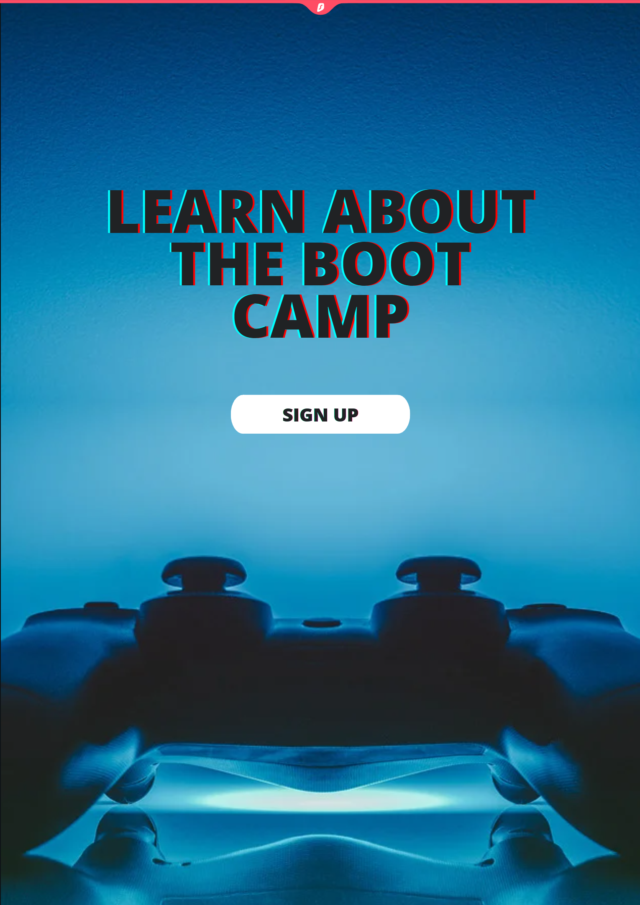
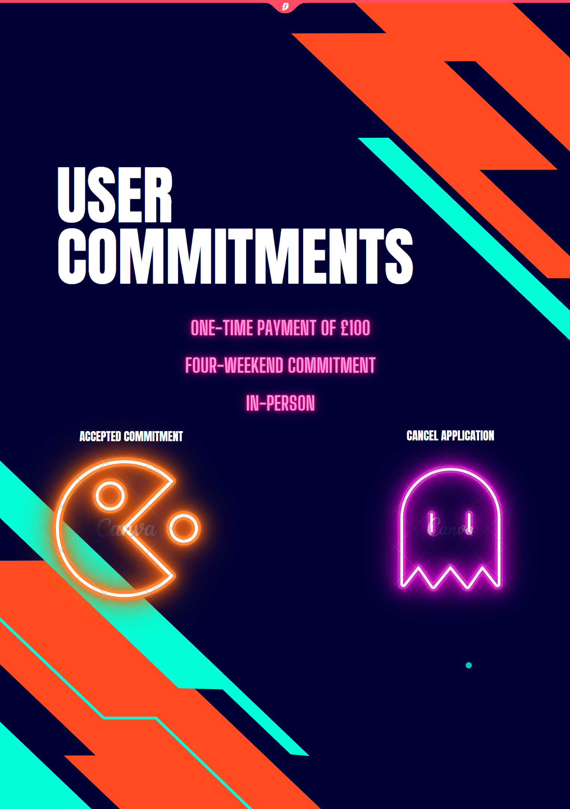
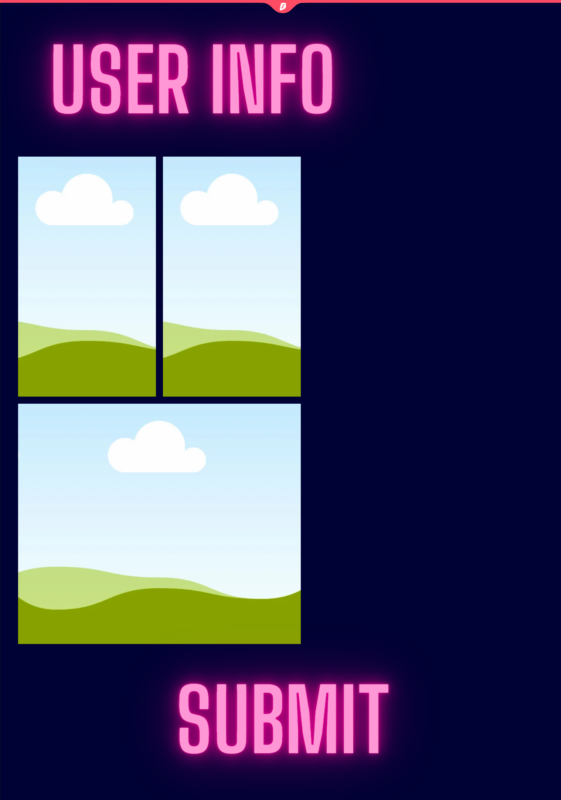

# 100 Days Of Code Journal / School of Code Bootcamp Journal

## Day 1

---

_Feb 26 2023_

### **Todays Progress:**

- 📚 I looked up info on markdown after looking at the brilliant diary kept by a former SOC student.

- 🖥️ I went back through my HTML and CSS code on the website I made and started adapting things to be more responsive.

- 📝 I'll have to go look up the command line info to connect to a new Repo I made so I can upload this Readme file but also so I can update this hopefully day by day.

### **Thoughts:**

💪 I'm lucky to have all these resources available, but I just hope I can use them to my full potential. I'm so happy to have been accepted into the School of Code. I want to do this 100 days of code challenge. It still feels daunting even if it's supposed to be an hour a day. Home life is about to change too with my youngest starting nursery. I will find the balance.

### **Links/resources:**

📺 https://youtu.be/Nj87GEXxhjc <-- Learning markdown in VS code

---

## Day 2

---

_Feb 27 2023_

### **Todays Progress:**

- 📚 I looked into creating a guide for myself for connecting to a repo again and then wrote it down in a word doc. As I had set up links for my previous repo but it had been a while still good to refresh on git inputs.

- 🖥️ I've more website stuff to check through before pushing to a branch before merging. I thought it better to keep my hand in with some Javascript work with codecademy today I had a go making classes that you use to make a new instance from. Here's a brief example:

```js
class Surgeon {
constructor(name, department) {
this.name = name;
this.department = department;
}
}

const surgeonRomero = new Surgeon('Francisco Romero', 'Cardiovascular');

console.log(surgeonRomero);

const surgeonJackson = new Surgeon('Ruth Jackson', 'Orthopedics');

console.log(surgeonJackson);

Output was:

Output:
Surgeon { name: 'Francisco Romero', department: 'Cardiovascular' }
Surgeon { name: 'Ruth Jackson', department: 'Orthopedics' }
```

- 📝 I think I'll continue with more of this tomorrow I'd like to complete the intermediate JS stuff section as it's good to have a bit consistency before doing something else.

### **Thoughts:**

Today I felt a little daunted as I was trying to make sure I was consistent. Also had to make sure I'd done all that was required before starting SOC bootcamp. It's like a building anxiety and excitement. I really want to do well, I worry about things but then I continued reading all of the drop downs and when I found structure to the days that lay ahead I realised that everyone will be in the same boat. I can do this I just have to keep believing or maybe I need to listening to live to win 10 times and get pumped up. 🎶🔥

### **Links/resources:**

🎵 https://open.spotify.com/track/74inHQGjQj6w630tZ9wb2J?si=db20b619864b43bd <--Live to win by paul stanley. Just incase you need a bit of pep.💪

🔗https://www.codecademy.com <-- code academy is a great little resource i've signed up for premium thanks to some kind pals with 50% codes. still got some great free stuff

---

## Day 3

---

_Feb 28 2023_

### **Todays Progress:**

- 📚 I looked into more info on how to progress with coding most of the information was as I expected. **CONSISTENCY IS KEY**

- 🖥️ So today on code academy I continued with my tasks on Inheritence I managed tasks I, II, III they were all right but IV was a new hope. Seriously though it was strange to understand tomorrow task V strikes back. Here's a look at some of the code from todays task.

```js
class HospitalEmployee {
  constructor(name) {
    this._name = name;
    this._remainingVacationDays = 20;
  }

  get name() {
    return this._name;
  }

  get remainingVacationDays() {
    return this._remainingVacationDays;
  }

  takeVacationDays(daysOff) {
    this._remainingVacationDays -= daysOff;
  }
}

class Nurse extends HospitalEmployee {
  constructor(name, certifications) {
    super(name);
    this._certifications = certifications;
  }
}

const nurseOlynyk = new Nurse('Olynyk', ['Trauma','Pediatrics']);
nurseOlynyk.takeVacationDays(5);
console.log(nurseOlynyk.remainingVacationDays);

Output to the log

15

```

- 📝 Tomorrow more code academy but I think I might have a look into some html and css work one thing I would love to have ago at is parallax scrolling animation. I have some pre made images from my batman website I never got round to trying.

### **Thoughts:**

Today was juggling act between home life and getting this done but I will keep moving forward. I feel like I need to try new things inbetween coding exercises just to give myself a break from things. :smile:

### **Links/resources:**

🔗 https://www.codecademy.com/ <-- same as day 2 💻

🎵https://open.spotify.com/episode/1fkJjlkkMHhaqckaoNMbnK?si=9230d5eac9a44ea7
<-- beta wave improve for conertration💡

🎵https://open.spotify.com/track/7lRsKDo94Xy3y1uqash1Xv?si=374ce79d9bc44ebf <-- for something after you beat that 1hr mark 🔥

---

## Day 4

---

_Mar 1 2023_

### **Todays Progress:**

- 📚 Today was the pre-lecture to SCHOOL OF CODE(SOC) we did a some work on notepad....it was fun but also painful. I was paired up with someone called Victoria hopefully they will recover from the shock of working with me. In truth it wasn't that bad it was nice to meet people and chat to someone new who isn't a 5 or 2 year old.

- 🖥️ So today I decided to continue with the practice of making something from scratch even if it is very very simple. It was to do with our brief conversation on stained glass windows.


- 📝 Tomorrow i'm a little torn i would like to complete code academy tasks before moving on to the next thing but Victoria got me thinking they revealed that they were making their own calculator. I'm not sure I would make that but it would be nice to do something like that. Magic 8 ball? Sources point to ..maybe.

### **Thoughts:**

Today was rough not for coding but from home life perspective. School strikes and a sick child were not a great 🤒 especially when it involves changing clothes of everyone involved twice and attempting to get a doctors appointment while you have a coughing fit a poor person on the end of the phone. Still if we ignore that ..... WHAT A GREAT ...EVENING it was. :D Really enjoyed the lecture from Liz

### **Links/resources:**

🔗https://codepen.io/tomuo-burns-tinkler<-- this is my codepen incase you are interested in seeing the little things i muck about making 💻

🎵https://open.spotify.com/track/09algRz68H2iEWhJQlYhqQ?si=88dc4efac7c54498 <-- Back to mine - Tycho(Bibio remix) I just needed to hear something to calm me after today lol what a day

---

## Day 5

---

_Mar 2 2023_

### **Todays Progress:**

- 📚 Today I wasn't sure where to start till someone else got stuck on something.

- 🖥️ I decided to actually have a look into how to make a calculator in Javascript because the person I was paired with was struggling with something. I'm unsure if i can help but i'll try so I managed the basics following a tutorial but i'll need to do more work on it. Heres the html it's not the most pretty looking thing but it's a start. I might have to look up more info for these things.

```js
<!DOCTYPE html>
<html>
  <head>
    <title>Calculator</title>
    <link rel="stylesheet" type="text/css" href="style.css" />
  </head>
  <body>
    <div id="calculator">
      <div id="numbers">
        <button type="button" onclick="appendToDisplay('1')">1</button>
        <button type="button" onclick="appendToDisplay('2')">2</button>
        <button type="button" onclick="appendToDisplay('3')">3</button>
        <button type="button" onclick="appendToDisplay('4')">4</button>
        <button type="button" onclick="appendToDisplay('5')">5</button>
        <button type="button" onclick="appendToDisplay('6')">6</button>
        <button type="button" onclick="appendToDisplay('7')">7</button>
        <button type="button" onclick="appendToDisplay('8')">8</button>
        <button type="button" onclick="appendToDisplay('9')">9</button>
        <button type="button" onclick="appendToDisplay('0')">0</button>
        <button type="button" onclick="appendToDisplay('.')">.</button>
        <button type="button" class="operator" onclick="clearDisplay()">
          C
        </button>
      </div>
      <div id="operators">
        <button type="button" class="operator" onclick="appendToDisplay('%')">
          %
        </button>
        <button type="button" class="operator" onclick="appendToDisplay('/')">
          /
        </button>
        <button type="button" class="operator" onclick="appendToDisplay('*')">
          *
        </button>
        <button type="button" class="operator" onclick="appendToDisplay('-')">
          -
        </button>
        <button type="button" class="operator" onclick="appendToDisplay('+')">
          +
        </button>
        <button type="button" class="operator" onclick="calculate()">=</button>
      </div>
    </div>
    <input type="text" id="display" />
    <script src="javascript.js"></script>
  </body>
</html>

```

- 📝 Tomorrow i'm going to continue working on this thing and maybe see if there are more in depth tutorials on how to do this. I'm still not sure what I'm doing though.

### **Thoughts:**

Family life can affect a lot of things and i'm trying to work out the new way to get the balance right. Taking breaks is important at work as well as out of work. I think I have to find a way to thank my partner for allowing me to do this course. She is precious to me. So today working on things again were difficult but for different reasons. Lets see what tomorrow brings.

### **Links/resources:**

🔗 https://codeburst.io/making-a-calculator-with-basic-html-css-and-javascript-part-1-1e4288f0bea1 this is where i started but I will probably be looking elsewhere for more help.

🎵 - no tunes tonight ha tomorrow I promise

---

## Day 6

---

_Mar 3 2023_

### **Todays Progress:**

- 📚 Today I went back through the very basic looking calculator and decided that I need to look for a better tutorial so after contacting my pal about what tutorial they used I was sent a link I started over.

- 🖥️ I got much further with this tutorial in a shorter amount of time but just like most video tutorials you follow along as quickly as you can but it doesn't always go to plan. I got a better result on the build but when it came to displaying the inputs i was getting nothing. I will have to start from the beginning and check through the files to make sure nothing is missing.


- 📝 Tomorrow i'm going to continue working on this in the hopes I figure out what I missed to get it up and running correctly.

### **Thoughts:**

Today was fun 😄 I feel like I got a fair bit done but there's still more to do and complete. I can do this maybe I just need some sleep in order to get there.

### **Links/resources:**

🔗 https://youtu.be/HQCLzqhiT2w <-- Tech2 etc -Build Simple Calculator With JavaScript HTML CSS | JavaScript Project

🎵 - https://open.spotify.com/track/2BAlPE15dKMXpB5Trutcak?si=cbd1f231b9db4e23 <-- Theme from Quantumania - Christophe Beck. Sooooo good I could listen to it on repeat infact I think I will.

---

## Day 7

---

_Mar 4 2023_

### **Todays Progress:**

- 📚 I was having trouble getting things to show up on the calculator but i worked out what i'd missed and got it working.sadly in the end certain fuctions wouldn't work. So I started again with a new tutorial

- 🖥️ I managed to get the bare bones done on the new calculator design. There is still plenty to do though. Its nothing more than a picture with a hover feature on the buttons.


- 📝 Tomorrow i'll be making this thing functional. It's not been easy getting anthing working lately.

### **Thoughts:**

Not a bad one today just a busy weekend day with the family so a little tricky finding time on my own. This tutorial seems bit clearer than the previous one when with explainations as to why things are done in certain ways.

### **Links/resources:**

🔗 https://youtu.be/j59qQ7YWLxw <-- Web Dev Simplified calculator tutorial

🎵 - https://open.spotify.com/track/3uUuGVFu1V7jTQL60S1r8z?si=3a954bc20d714fb1 <-- Where are you now - Lost Frequencies, Calum Scott. Not probably a bit of an earworm

---

## Day 8

---

_Mar 5 2023_

### **Todays Progress:**

- 📚 This new tutorial is better but it is not without some confusing information as the tutor seems to have a completed version of his calculator which occasionally he uses to show what should happen. This felt counter productive as I kept thinking i'd failed when it wasn't happening only to find out later that I hadn't actually called anything yet for it to function. Still this is progress.

- 🖥️ I got a calculator working and then following the instructions of the tutor promptly broke it again haha 😂 i'm sure I can get it working better though. An image before the destruction

<div>

<p align="center">
  
</p>
</div>

- 📝 Tomorrow i'll keep going see if I can beat this before the 10 day mark and hopefully i'll get some Code wars in.

### **Thoughts:**

Not bad just tired from the day. I got further than i expected. I've an early start tomorrow so I'll have to leave this here again for another day.

### **Links/resources:**

🔗 https://youtu.be/j59qQ7YWLxw <-- Web Dev Simplified calculator tutorial

🎵 - https://open.spotify.com/episode/4G9geVUuuWwCLoULRbnSIS?si=6a38911680744fb5 <-- Howl's flower field - Studio ghibli relaxing ambience - by nature sound to relax 🌸, for those who might be fans of Howls Moving Castle and Nature I guess.

---

## Day 9

---

_Mar 6 2023_

### **Todays Progress:**

- 📚 I changed it up tonight I will probably finish the calculator tomorrow he writes with confidence.... Tonight I tried my hand at code wars and succeed but I did have to search various methods for producing what i wanted. I learned about split which can take information and break it into individual parts placing it all in an array.

- 🖥️ So the challenge was to take Troll messages and remove the vowels from them in order to make there messages unreadable.

```js
function disemvowel(str) {
  // defining the vowels
  const vowels = 'aeiouAEIOU';

  // trollString takes a string(str) then uses split
  const trollString = str.split('').filter(char => !vowels.includes(char)).join('');

  // returning the new string without vowels
  return trollString;
}

console.log(disemvowel("This website is for losers LOL!"));
console.log(disemvowel("No offense but,\nYour writing is among the worst I've ever read"));
console.log(disemvowel("What are you, a communist?"));
```

```js
Logs

Ths wbst s fr lsrs LL!
N ffns bt,
Yr wrtng s mng th wrst 'v vr rd
Wht r y,  cmmnst?
```

- 📝 Tomorrow I'll finish the calculator and maybe begin my next coding challenge

### **Thoughts:**

Today I'm tired but happy, hopefully I can get more done tomorrow. I didn't get as much as I would have liked to have done today but... I did something at least 😊

### **Links/resources:**

🔗 https://www.codewars.com/kata/52fba66badcd10859f00097e/train/javascript <-- code wars challenge

🎵 - https://open.spotify.com/track/6zumS30r4xE6o8gZTip0Lc?si=46974bb060cd4a50 <-- Rising Sun - by Aberdeen just something pleasant to listen to.🎧

---

## Day 10

---

_Mar 7 2023_

### **Todays Progress:**

- 📚 Today I did way more than I expected. I had at creating drums kit on keyboard. I did something on freecodecamp "Iterate Through the Keys of an Object with a for...in Statement" which was to run a loop through an object for looking for true of false values. I finished the calculator which I was surprised about too. I even added an extra function which were keyboard inputs.

- 🖥️ It's been a good day! I FINISHED THE CALCULATOR...and i added extra keyboard inputs i know i said that already but i didn't expect to get it done today. I also managed to do a loop through an object. My examples:

```js
const users = {
  Alan: {
    online: false
  },
  Jeff: {
    online: true
  },
  Sarah: {
    online: false
  }
}

function countOnline(usersObj) {
  // Only change code below this line
let onlineUsers = 0;

for(let user in usersObj){

  if(usersObj[user]["online"] === true){
    onlineUsers += 1;
  }
}

return onlineUsers;

  // Only change code above this line
}
```

```js
Logs

// running tests
// tests completed
// console output
1
```

<a href='https://codepen.io/tomuo-burns-tinkler/pen/bGxRWMp'></a>

- 📝 Tomorrow I'll try to continue with free code camp for some more javascript and possibly some more advanced HTML and CSS.

### **Thoughts:**

Great day today😊 felt very productive got a fair few things done. I want to keep going see what I can push myself to do. 🐱‍🐉 Probably keep it small before trying anything too time consuming and having to bother people for answers 😀

### **Links/resources:**

🔗 https://codepen.io/tomuo-burns-tinkler/pen/bGxRWMp <-- codepen link again

🔗 https://www.freecodecamp.org/learn/javascript-algorithms-and-data-structures/ basic-data-structures/iterate-through-the-keys-of-an-object-with-a-for---in-statement <-- The freecodecamp task

🔗 https://javascript30.com/ <-- 30 days of javascript tasks kinda fun but best to know some fundamentals

🎵 https://open.spotify.com/album/49i6QxFHTMt4e9aopUO8pm?si=5d722uy2QYOxm0B8_iaQ4Q <-- Frogged & Loaded - by Pete Frogs game covers that sound fantastic.🎧

---

## Day 11

---

_Mar 8 2023_

### **Todays Progress:**

- 📚 Today I watched some shorts by a Youtuber called Hyperplexed they.... are on another level. Decided to go back through javascript fundamentals as there were things that thought i should have been able to do in my Codewars challenge but I couldn't remember how to do it.

- 🖥️ So I went through some of his tutorials with Hyperplexed I made a hacker effect which was interesting my one working example:

<p align="center"></p>

I'm also trying a few other Hyperplexed tutorials out though why not.

- 📝 Tomorrow when I get a chance I think I will finish any current things i'm working on and then start focusing back on Javascript fundamentals.

### **Thoughts:**

Not a bad day, nice to try things out and see if you can replicate and adapt them for other purposes. Had the Bootcamp Social today. I became the team captain, we called out selves the Partners In Crime. We took part in a quiz sadly we didn't place but what can you do.
I feel like I need to focus more on the JS side of things. When i've tried to build things on my own i do get stuck quite quickly and find myself looking for answers elsewhere.

### **Links/resources:**

🔗 https://codepen.io/tomuo-burns-tinkler/full/oNPGyKM <-- codepen link again

🔗 https://www.youtube.com/@Hyperplexed <-- if you want something nice and quick to ponder over give Hyperplexed a look at.

🎵 https://open.spotify.com/artist/1T7zBkQCOCacKjbnmFX7cp?si=a8mIvqHlRvaM0Bfl3l_1yA.🎧 <-- more gaming music tonight what can I say.

---

## Day 12

---

_Mar 9 2023_

### **Todays Progress:**

- 📚 Today I was more of a research day, looking into various collections for creating and learning code.

- 🖥️ Codewars is the thing I got stuck multiple times today but got two done with a lot of looking things up. Here's one Challenge

**Convert number to reversed array of digits**

```js
function digitize(n) {
  // turns numbers into a string then splits them into an array of numbers
  const digits = String(n).split('');
  // takes the array of strings, reverses it then map converts them back into array of numbers
  return digits.reverse().map(Number);
}


console.log(digitize(35231)); // Output: [1, 3, 2, 5, 3]
console.log(digitize(0));     // Output: [0]
console.log(digitize(12345)); // Output: [5, 4, 3, 2, 1]

```

- 📝 Tomorrow maybe it will be more fruitful

### **Thoughts:**

Certain things today were out of my hands we lost two beloved rabbits to a fox in the night. So there was plenty of distractions on the mind and self blame. Tomorrow I'm sure will bare more fruit.

### **Links/resources:**

🔗 https://javascript.info/ <-- great javascript reference material

🔗 https://apps.ankiweb.net/ <-- if you want digital flash cards this is the place to make them

🎵 https://open.spotify.com/artist/7LbEDjJKrmWoMcN3OpaNnR?si=B4ihaikvR9y1Z1WViQkCwQ🎧 <-- Dramatic film scores by Daniel Pemberton

---

## Day 13

---

_Mar 11 2023_

### **Todays Progress:**

- 📚 Today a comedy of errors, I decided to look into mdn stuff and found a 2D javascript Brick Breaker/ Breakout game

- 🖥️ Somethings went wrong but I started again and either way I have the start of a canvas with some shapes on it but it's just the start.

<p align="center"></p>

- 📝 Tomorrow I will try and get much further hopefully have something to show on here.

### **Thoughts:**

This might be a short look at this game as I will finally starting SCHOOL OF CODE on Monday. Unfortunately my usb was snapped by one of my children lucky I had a backup. Very tired today carried over from yesterday where I got nothing much done.

### **Links/resources:**

🔗https://developer.mozilla.org/en-US/docs/Games/Tutorials/2D_Breakout_game_pure_JavaScript <-- great javascript reference material

🎵 https://open.spotify.com/track/2sifRHahNmhTR7a3BjKc9u?si=e12c817d9a1d408c🎧 <-- Timebomb Zone by The Prodigy if you want something to keep you awake these guys do the trick

---

## Day 14

---

_Mar 13 2023_

### **Todays Progress:**

- 📚 It's been a long day, I've started SCHOOL OF CODE! so today was a lot of new experiences. We did some CSS diner work something new that I need to learn.

- 🖥️ we worked in teams to make instruct each other to get the answers. We didn't finish all 32 but i did on my own.

<p align="center"></p>

- 📝 It a new start with SOC so if there is something i need to work on it may affect my choice in work

### **Thoughts:**

Today was fantastic, I got meet a lot of new people. It does mean i will have to put in a fair bit of effort now in order to make life easier later.

### **Links/resources:**

🔗https://flukeout.github.io/ <-- CSS Diner

🎵 https://www.audible.co.uk/pd/Age-of-Stone-Audiobook/1666111228?action_code=ASSGB149080119000H&share_location=pdp 🎧 <-- Audio book tonight Age of stone Jez Cajiao

---

## Day 15

---

_Mar 14 2023_

### **Todays Progress:**

- 📚 Today was one step forward and two steps back, used flow charts today to define the working of a graduation then we had to do the same for a login screen on scratch which seemed simple in flow but not simple in scratch. It got very confusing when I couldn't figure out a way to loop back on incorrect username and passwords. Almost had it working. I managed to get git sorted at least so I pulled from the repo and sent through a change.

- 🖥️ We worked in pairs today which was nice although there were a few hiccups at the start. So I paired up with someone else for most of the morning but in the afternoon I was back with my intended partner.

<p align="center"></p>

- 📝 I did this as it was something we didn't get to finish as much as we wanted to. Sometimes there's not enough hours in the day.

### **Thoughts:**

I guess the only way was down from yesterday ha, well let's just say it didn't quite go the way I hoped today. I need to get out my own way sometimes. Just go for the easiest way to complete a task rather than worry about is it fair to google to answer a puzzle. It's fine if it's for SOC it's not if it's down the local pub quiz. I think some day's will be like this others might be easier all we can do is our best.

### **Links/resources:**

🔗<-- no links today

🎵 https://www.audible.co.uk/pd/Age-of-Stone-Audiobook/1666111228?action_code=ASSGB149080119000H&share_location=pdp 🎧 <-- Audio book tonight Age of stone Jez Cajiao

---

## Day 16

---

_Mar 15 2023_

### **Todays Progress:**

- 📚 Today was learning basics but it was still not easy and I think I need to simplify my thinking

- 🖥️ worked with some of the teammates we did bits back and forth making sure code worked on each other screens. It was a lot of screen sharing but I think it's important. This was one of the tasks we had to do which was adding a password checker prompt.

### Task E

```js
function authenticateUser() {
  let pwd = "myPassword1!";
  let attempts = 0;
  let maxAttempts = 3;

  while (attempts < maxAttempts) {
    let getPwd = prompt("Please enter password.");
    if (getPwd === pwd) {
      console.log("My favourite colour is #000080!");
      alert("It was Rolo Tomazee");
      return true; // return true if password is correct
    } else {
      attempts++;
      alert(`Incorrect password. ${maxAttempts - attempts} attempts left`);
    }
  }

  return false; // return false if too many attempts
}

let isLoggedIn = authenticateUser();

if (isLoggedIn) {
  // reveal secret information here
} else {
  alert("ACCESS DENIED");
}

```

- 📝 We caught up with things today although some of the work we put in didn't quite go the way we expected.

### **Thoughts:**

I won't say today was easy but somethings made sense but I'm still not sure I understand what I'm doing. I just hope I'm on the right track. I'm glad I had someone watching me put things together they help keep you from making mistakes when you are too close to the code.

### **Links/resources:**

🔗<-- no links today maybe when things calm down a bit ha

🎵 https://www.audible.co.uk/pd/Age-of-Stone-Audiobook/1666111228?action_code=ASSGB149080119000H&share_location=pdp 🎧 <-- Audio book tonight Age of stone Jez Cajiao

---

## Day 17

---

_Mar 16 2023_

### **Todays Progress:**

- 📚 Today we went deep into variables and learned the differences between them or at I think we did, Var = function scoped, const is usually for unchangeable code and its block scoped and let allows you to change things and is also block scoped. We also did a session on Arrays[] the many things you can put in them. We also looked into how to iterate through them and also Arrays["within arrays"]; or even [ {}, {}, {}, {}, {}, {}] objects in arrays. 

- 🖥️ we did a lot of work between us the only thing we are struggling with seems to be pushing and pulling from github. We thought it best to just work through the tasks together and then think about pushing them back at a later time. 

### here's one of my favorite tasks from today given an array add "t" to the end of each item. 

```js
let words = ["ben", "ha", "spla", "fa", "ca", "dra"];

for (let i = 0; i < words.length; i++) {
  words[i] += "t";
}

console.log(words);

output

['bent', 'hat', 'splat', 'fat', 'cat', 'drat']

```

- 📝 We caught up with things today although some of the work we put in didn't quite go the way we expected.

### **Thoughts:**

I felt as a team we connected with the material and the teaching so much more than in the previous lesson. It feels like we have mini breakthroughs followed by stumpers again. I enjoyed today it was great and not feeling like we have to catch up with everything was even better. I think we still have to work on pushing and pulling in Github. 

### **Links/resources:**

🔗<-- no links today maybe when things calm down a bit ha

🎵 https://www.audible.co.uk/pd/Age-of-Stone-Audiobook/1666111228?action_code=ASSGB149080119000H&share_location=pdp 🎧 <-- Audio book tonight Age of stone Jez Cajiao

---

## Day 18

---

_Mar 17 2023_

### **Todays Progress:**

- 📚 Today was our first Hackathon my partner was great at keeping my thoughts in check today. We managed to get a lot done and we managed to do a little bit of git work. In the hackathon we had to make a Rock Paper Scissors game.  

- 🖥️  It was a fun day glad I got do something a little different I remembered things I'd done before in past tutorial videos and with my work partner giving great suggestions and noticing things that i misspelt (sissors) or noticing that something wasn't working in testing. Then things just started working and just as we started to get going it was time to check out other groups work and let them offer a take on your work. We all helped figure out a looping issue. Then it was time to get ready for the weekend.

### here's the game so far. 

```js
function getWinner(playerMove, computerMove) {
    if(playerMove === computerMove){
        return 0;
    // console.log("It's a draw");
}else if((playerMove === "rock" && computerMove === "scissors")||
(playerMove === "scissors" && computerMove === "paper")||
(playerMove === "paper" && computerMove === "rock")){
    return 1;
    // console.log("You win!");   
}
 
else{
    return -1;
    // console.log("Computer wins!");

}
  }
  

  function getRandomMove(){
    const choices = ["rock", "paper", "scissors"]
    let randomChoice = (Math.random() * choices.length);
    return choices[randomChoice]; // returns array after it's been put through the randomChoice.
  }
 

// takes players input 
let playerMove = prompt("Enter choice rock, paper or scissors");
let computerMove = getRandomMove();
// player input vs computer 

let result = getWinner(playerMove, computerMove);

if(result === 1){
  alert("You Win!");
}else if(result === 0){
  alert("It's a Draw!");
}else{
  alert("You Lose!");
}

```

- 📝 I think I'll continue trying to do all the tasks for this hackathon it should be good practice.

### **Thoughts:**

I think this week has been intense but also amazing it's really great because I didn't expect to actually understand anything yet. Still plenty to learn.

### **Links/resources:**

🔗<-- no links today maybe when things calm down a bit ha

🎵 https://www.audible.co.uk/pd/Age-of-Stone-Audiobook/1666111228?action_code=ASSGB149080119000H&share_location=pdp 🎧 <-- Audio book tonight Age of stone Jez Cajiao


---

## Day 19

---

_Mar 18 2023_

### **Todays Progress:**

- 📚 Following off the back of a hackathon one of my cohorts suggested they would try and make a playable version of rock paper scissors in Html well i wanted to try that too granted I hadn't completed all my tasks from the hackathon but still. 

- 🖥️  I took my latest version of functions but I had to get rid of a lot of things to replace them with for use with html but as i wasn't sure how to do it found a handy Youtube video by Ania Kubow. 


### here's the game so far I even added the variants for the end of the game.  


- 📝 Hopefully tomorrow I can get some more cementing in of various coding practices and more programming knowledge. I need to push myself more.  

### **Thoughts:**

I think i'm happy with the small test I did and it was odd following a tutorial but replacing all the parts to suit my previously existing coding. Somethings didn't quite work at first but I got something working and I'm happy I added Math.floor(Math.random () * choices.length); So I could add the lizard and spock. 

### **Links/resources:**

🔗https://youtu.be/RwFeg0cEZvQ<-- Ania Kubow is a fantastic programmer I need to do more of her tutorials.

🎵 https://www.audible.co.uk/pd/Age-of-Stone-Audiobook/1666111228?action_code=ASSGB149080119000H&share_location=pdp 🎧 <-- Audio book tonight Age of stone Jez Cajiao

---

## Day 20

---

_Mar 19 2023_

### **Todays Progress:**

- 📚 So today I started the day will a catch up with other cohorts looking to keep going through the basics it was good. I think I'd forgotten quite a few things. Nice meeting people again though some new some i just hadn't spoken to yet. 

- 🖥️ I went back through some of my unfinished tasks from week one. I'll probably have to go back through some more and maybe as things will become easier.

### here's the task 6 arrays work I rejigged

```js
const friend = [ "Chris", "Lizzie", "Ben", "Tao", "Liz", "Patrick", "Tim", "James", "Joseph", "Max",];

function randomFriend() {
  const friendArr = Math.floor(Math.random() * friend.length);
  return friend[friendArr];
}
const myFriend = randomFriend();
console.log(myFriend);

output will be a random name in the friend array. tried it twice and got Ben and Chris

```
I also did 3 code wars for practice today 

here one of them is

```js
  
function min(num){
    return Math.min.apply(null, num);
   
}

function max(num) {
    return Math.max.apply(null, num);
    
  
}

const arr1 = [4,6,2,1,9,63,-134,566]; 
const arr2 = [-52, 56, 30, 29, -54, 0, -110];
const arr3 = [42, 54, 65, 87, 0];
const arr4 = [5];

console.log(max(arr1)); 
console.log(min(arr2));
console.log(max(arr3)); 
console.log(min(arr4));
console.log(max(arr4));

```
```js
output Log
566 (max)
-110 (min)
87 (max)
5 (min)
5 (max)

```


- 📝 Tomorrow will be the beginning of a new set of challenges and probably a new partner to get used to. I hope I don't fall behind but I look forward to seeing what comes next. 

### **Thoughts:**

I will have to finish a lot more of my tasks and upload them to github while i'm at it. It's much harder to do work on weekends though.

### **Links/resources:**

🔗<-- less links again today

🎵 https://open.spotify.com/track/4VkEkljlOC5cMbRMhREO5E?si=a0a8ce0c8f7b468d🎧 <-- Snowfall(slowed + Reverb) - Oneheart just an earworm of a listen. 

---

## Day 21

---

_Mar 20 2023_

### **Todays Progress:**

- 📚 The start of week 2. Was a little rough hopefully things will improve through the week nothing goes off without a hitch. Might have to sort out all of my Git stuff this week if I can. DOM manipulation was the key this week. New partners seem to have a better grip on things than I do currently but it's early days.

- 🖥️ I did a some code wars today, we also tried to do some focus on manipulation of the DOM 

### here's the one of the codewars from tonight

```
function reverseWords(str) {
    return str.split("").reverse().join("").split(" ").reverse().join(" ")
    
}

console.log(reverseWords("The quick brown fox jumps over the lazy dog."));
Output ehT kciuq nworb xof spmuj revo eht yzal .god

```


- 📝 Tomorrow I hope will be an improvement on today. I have a feeling every week will be a bit like this where I feel a bit out of my depth. I hope to pull my weight tomorrow when working in a team of three. I feel a bit like the weak link currently. 

### **Thoughts:**

Hopefully tomorrow people will be a bit more talkative. New pair of people are rather quiet which makes it hard to communicate. I may have to get used to the way they do things. 

### **Links/resources:**

🔗 https://www.codewars.com/<-- less links again today

🎵 https://open.spotify.com/track/1Q1onoQM04M590VO7aLOyt?si=a64c037d4f364c1b🎧 <-- Nujabes, The Champloo  
---

## Day 22

---

_Mar 21 2023_

### **Todays Progress:**

- 📚 Much better day today got to meet people who work in the industry. Teamwork was much better today got to help a teammate make a pokemon version of rock paper scissors. We had some fun making things today learning to create helpful comments that explain what the code does

- 🖥️ More DOM manipulation today, working with eventListeners. we did a codewars in the morning.

###  Here's some the tasks we did today


```js
/////////////////////////////// Task 1

// variable button connected to the button id #click-me
const button = document.querySelector("#click-me"); 

  // This function logs a few messages and changes the label on the button
function handleClick(event) {
  // If clicked, console log you clicked me!
  console.log("You clicked me!");
  // If shift key pressed, change the inner text of the button to be NAILED IT.
  if(event.shiftKey === true){
    const clickMe = document.querySelector("#click-me");
    clickMe.textContent = "NAILED IT!!";
  }
  console.log(handleClick);
}

/////////////////////////////// Task 2

// flowerButton variable assigned to the class of task-2
let flowerButton = document.querySelector (".task-2");

// 
function flowerTitle (e) {
  document.title = "💐🌷🌼";
}
flowerButton.addEventListener("click",flowerTitle);

button.addEventListener("click", handleClick);

document.querySelector("#title-changer").addEventListener("keyup", (e) => {
  console.log(e.target.value);
});

/////////////////////////////// Task 3

let titleChanger = document.querySelector
(`#title-changer`)
let h1 = document.querySelector("h1");

function findValue (event) {
  h1.textContent = event.target.value;
} 
titleChanger.addEventListener("keyup", findValue) 

/////////////////////////////// Task 4
//variable of image
const img = document.querySelector("img");

// function that changes the h1 colour to hotpink
function hotpink(){
 const h1= document.querySelector("h1"); 
  h1.style.color = "hotpink";   
}

//function that changes back to the original colour
function initial() {
  const h1= document.querySelector("h1");
  h1.style.color = "initial";
}

//img with a listeners for mouseenter and mouseleave so when you put your mouse on the img
img.addEventListener("mouseenter", hotpink);
img.addEventListener("mouseleave", initial);

```

- 📝 Tomorrow I'm sure will be a new day but I hope the group will be chatty again and that we can keep the work tasks up too.  

### **Thoughts:**

So much better today, everyone was a bit more chatty which meant we started to get stuff done as a team which was very helpful. Have to try and keep this all going for the rest of the week. I'm going back through the previous weeks work to make sure everything is done. 

### **Links/resources:**

🔗 https://www.codewars.com/<-- might just leave this link here forever as its not a daily ritual

🎵 https://open.spotify.com/track/1Q1onoQM04M590VO7aLOyt?si=a64c037d4f364c1b🎧 <-- Nujabes, The Champloo  
---

## Day 23

---

_Mar 22 2023_

### **Todays Progress:**

- 📚 This was a tough day for understanding, I had to take a break to unwind with all these DOM task. It feels like my head was about to fall off. It was interesting but difficult.

- 🖥️ More DOM manipulation today we tried to make a clock before lunch then after it was a focus on we did a codewars in the morning. The codewars was pretty hard but I got there in the end.

###  Here's some the tasks we did today


```js
// write an async function called getQuote
// use a fetch request to get a random quote from the following API: https://meowfacts.herokuapp.com/
// the value will need to be store in a variable called response

// use the .json() method to unpack the json data from the response and store it in a variable called data
// make sure to await the response from the .json() method and the fetch request

// use the data from the response to set the text of h1 with the id of quote to the first quote in the data array

//call the function so the quote is displayed when the page loads

// Task 2 add eventlistener to the button with the id of #new-quote-button that calls the getQuote function when clicked

// Task 3 create a new function that takes a string, it will add a new list item with that string and add it to an ol with the id of quote-history

// This function fetches the quote from the API and displays it on the page
// function takes a string, it will add a new list item with that string and add it to an ol with the id of quote-history 
async function getQuote() { 
  const response = await fetch("https://meowfacts.herokuapp.com/");
  const data = await response.json();
  const h1 = document.querySelector("#quote");
  h1.textContent = data.data[0];
  console.log(data);
  list(data.data[0]);
}

const quoteHistory = new Set();
// This function adds a new list item with the quote to the ol with the id of quote-history
function list(quote) {
  if (!quoteHistory.has(quote)) {
    quoteHistory.add(quote);
    const newLi = document.createElement("ol");
    newLi.textContent = quote;
    document.querySelector("#quote-history").appendChild(newLi);
  }
}
getQuote();

// Add event listener to the button with the id of #new-quote-button that calls the getQuote function when clicked
let newQuoteButton = document.querySelector("#new-quote-button");
newQuoteButton.addEventListener("click", getQuote);

// Bonus Task 1 add to the list function a way to remove duplicates from the list


```


- 📝 Tomorrow will hopefully be a good day some of todays work was mind crumbling in difficulty for me at least.    

### **Thoughts:**

The team still works individually from time to time, which i'm not that keen on but still everyone is communication when they think they have worked things out. 

### **Links/resources:**

🔗 https://www.codewars.com/<-- might just leave this link here forever as its not a daily ritual

🎵 https://www.audible.co.uk/pd/Age-of-Bronze-Audiobook/B09XYLCFYN?action_code=ASSGB149080119000H&share_location=pdp 🎧 <-- The next book "Age of bronze  

---

## Day 24

---

_Mar 23 2023_

### **Todays Progress:**

- 📚 Today was a nice break from the normal routine of coding I learned some new things and I was introduced to the world of UX design thanks to the magician known as Paavan. He even showed us a coin trick with technique called the french drop. Then showed us the magic of UX design. Tonight though I decided to go back through some of my old code in order to make sure I was understanding adding comments to them so that it was clear what I had been attempting to do, I also sorted out a bunch pushes to GitHub. 

- 🖥️ Tonight I decided to look back through passed tasks and get as much of it commented to make more sense of what I did and what I created.

###  Here's some of the updated tasks I did tonight


```js

/////////////////////////////// Task 2

// make a variable for the called flowerButton
// make a function that changes the title of the of the document and changes it to flower emoji's. 
const flowerButton = document.querySelector(".task-2");
function titleChange() {
  document.title = "🌸🌺🌼🌻🌹🌷🌱🌿🌾🌵🌴🌲🌳🌰🌱🌿🌾🌵🌴🌲🌳🌰";
}
flowerButton.addEventListener("click", titleChange);


/////////////////////////////// Task 5

// add an event listener to checkbox input
// the checkbox will toggle the class of .funky on and off on the h1 element

const checkbox = document.querySelector("#check-box");
checkbox.addEventListener("change", (e) => { 
    h1.classList.toggle("funky");
});

```


- 📝 Tomorrow is friday so I expect it will be another Hackathon who knows where we will end up this time. But if I had to guess maybe something to do with this weeks tasks but focused into a new build maybe a todo list or something.    

### **Thoughts:**

The team work went up a notch today as the groups were expanded for other tasks and I have to say things went a whole lot differently and in some ways it was much better than previous days. We all worked better together to create a short video it was good fun. We even worked on some of the codewars stuff but I still didn't quite get it maybe I need to get back into maths again. 

### **Links/resources:**

🔗 https://www.codewars.com/<-- Some of the code wars today were very challenging

🎵 https://open.spotify.com/track/1GCJGhtticxBvH9PP7Qko0?si=5a77c0620a5c427e 🎧 <-- something nostalgic to keep me going.  

---

## Day 25

---

_Mar 24 2023_

### **Todays Progress:**

- 📚 HACKATHOOOOOOON, so today we had to make something using an API it was good fun but also pretty hard some did better than others but it was definitely a learning experience all around. So we chose a trivia API and we had to make a trivia game. I was the driver for most of the build as one of our team was having issues getting anything to work. I was also the navigator briefly before lunch and driver again after. 

- 🖥️ So I'll show you the code and an image of the game working. sort of i mean we didn't get the score or answer section to work but we did get the questions to work. Also the answer button worked so you could find out if you were right but the issue was you couldn't select an answer from the options.

###  Here's the hackathon code


```js

// send a fetch to all the API'S servers
// check the APi works in the console.log in the browser 


/////////////////////////////////// step 2
// Trivia question from the API array. 
// button click to reveal the answer 

// create async function that takes a question and returns a response
async function trivia (){
        const response = await fetch("https://opentdb.com/api.php?amount=1");
        const data = await response.json();

        // variable that takes the JSON response and returns it as a string to the h2 id of #insert-question
         
        let insertQuestion = document.querySelector("#insert-question")
        let currentQuestion = data.results[0];
        insertQuestion.innerHTML = currentQuestion.question;
                
        //create a ul element in html
        //assign a variable to ul element

        let multipleChoice = document.querySelector("#multiple-choice") 

        // if type = multiple - create li element for
        //everything in incorrect answers array + correct answer array

        multipleChoice.innerHTML = ""
        if (currentQuestion.type === 'multiple'){
                for (i = 0; i < currentQuestion.incorrect_answers.length; i++){
                       let newLi = document.createElement('li');
                       newLi.innerHTML = currentQuestion.incorrect_answers[i];
                       multipleChoice.appendChild(newLi);
                };
                let correctLi = document.createElement('li');
                correctLi.innerHTML = currentQuestion.correct_answer;
                multipleChoice.appendChild(correctLi);
                
        }else if (currentQuestion.type === 'boolean'){
                multipleChoice.innerHTML = 'True or False?';
            }
        // create variable for answer button

        let answerButton = document.querySelector('#answer-button');
        // add eventlistener to the answer button

        answerButton.addEventListener('click', getAnswer)

        // create function that takes in the click event
        // make variable for p id #answer
        // change answer text

        let answerP = document.querySelector("#answer-p")
        answerP.innerHTML = ""
        function getAnswer(event){

                
                answerP.innerHTML = currentQuestion.correct_answer
        }
        console.log(data)
}
//call function when page is loaded
trivia();

//create variable for new question button
let newQuestionButton = document.querySelector('#new-question')
// add event listener to question button
newQuestionButton.addEventListener('click', trivia)
//create function that takes in click event and runs trivia function


//appendchild all li elements created to ul
         
        
```


- 📝 The weekend begins tomorrow I'd like to do some more coding but I may have children to look after so we'll see how that goes. If I can spare some time I might try get some Codewars done. There are some other tasks to complete also which I will try to get round to.    

### **Thoughts:**

The teamwork today was good I'm glad the I had some good navigators nearby to help me out when I got stuck. As things progressed it became easier to sort things out as they were happening. I'm glad I was able to help out and get the game working. I'm looking forward to the next hackathon I wonder who I'll be paired with next week and what we'll be making. I hope I'll be up to the task. 

### **Links/resources:**

🔗 https://codepen.io/tomuo-burns-tinkler/pen/abaPRqd<-- Here's the codepen for the game it still needs some work but it's a start.

🎵 https://open.spotify.com/artist/0xsml01TI210Co1sfqxyAi?si=zEBquxVbSk-g2TOiCMGYzw 🎧 <-- Soothing music to help me relax.   

---

## Day 26

---

_Mar 25 2023_

### **Todays Progress:**

- 📚 Weekend means i'm doing less than my usual bootcamp days but I decided to catch up on the recap stuff that we have been left to do. 

- 🖥️ I did Task 1 and started Task 2 today. I'm not sure how long it will take me to complete the tasks but I'm going to try and get them done before the next bootcamp day.

###  Here's the recap code


```js

 /////////////////////////// Task 1

// write a function called makeLegend(name) should accept a string
// This function should return a string which includes the name
// and concatenate the string (name) + " is now a legend"

const celebs = [
  "David Beckham",
  "Cher",
  "Madonna",
  "Tom Petty",
  "Cristiano Ronaldo",
  "Whoopi Goldberg",
  "Samuel L Jackson",
  "Angelina Jolie",
  "Richard Osman",
  "Emma Thompson",
];


function makeLegend(name) {
  return name + " is now a legend";
}

console.log(makeLegend("Tom Petty"));


// using the makeLegend function create a for loop that iterates over the celebs array
// This should change all the names in the array to a legend
// for example: "David Beckham" should become "David Beckham is now a legend"

for (let i = 0; i < celebs.length; i++) {
  celebs[i] = makeLegend(celebs[i]);
}


console.log(celebs);

// use another for loop to produce a new array of all the celeb names which start with a vowel.
// Store this in a variable called "vowelCelebs"
// Check the first letter in the array for A, E, I, O, U
// if the first letter is a vowel then push it to the empty vowelCelebs array

let vowelCelebs = []; // empty array waiting for pushed items

for (let i = 0; i < celebs.length; i++) {
  // if statement checks the first letter of each item in the array
  // if they match then they are pushed to the vowelCelebs array
  if (celebs[i][0] === "A" || celebs[i][0] === "E" ||celebs[i][0] === "I" || celebs[i][0] === "O" || celebs[i][0] === "U")
  vowelCelebs.push(celebs[i])
}

console.log(vowelCelebs);
      
        
```


- 📝 If I can manage to get myself organised i might get some join the coffee and code session tomorrow. I'm not sure how much time I'll have to do anything else but I'll try my best. I have to get my son to see his grandparents tomorrow so I'll have to make sure I have enough time to do that.    

### **Thoughts:**

It feels like a steep drop in learning because it's the weekend and I'm not doing the usual bootcamp stuff. I'm glad I'm able to do the recap stuff though. I'm looking forward to the next bootcamp day. I wonder what we'll be doing. I hope I'll be able to keep up with the pace.

### **Links/resources:**

🔗 <-- Nothing to link to today.

🎵 https://open.spotify.com/artist/0xsml01TI210Co1sfqxyAi?si=zEBquxVbSk-g2TOiCMGYzw 🎧 <-- Soothing music to help me relax.   

---

## Day 27

---

_Mar 26 2023_

### **Todays Progress:**

- 📚 Caught up some of the recap stuff. I managed to make it to the coffee morning coding session. I was a bit late but I managed to get some work done.

- 🖥️ I did Task 2, Task 3 and Task 4 today. Although Task 4 is the Bonus task I decided to attempt it anyway. As it's a later start tomorrow I might try and get some more done before the bootcamp day begins.

###  Here's MORE recap code


```js
///////////////////////////////////Task 2

let count = 0;
let twelveSeconds = document.querySelector("#count");
twelveSeconds.innerHTML = 0;

// setIterval function is set for 1000 milliseconds or 1 second
// the count variable is incremented by 1 every second
let timer = setInterval(() => {
    count++;
    twelveSeconds.innerHTML = count;
}, 1000);

// the setIterval function is stopped after 12 seconds
setTimeout(() => {
    clearInterval(timer);
}, 12000);

//////////////////////////////////Task 3

async function getCat() {
    const response = await fetch("https://api.thecatapi.com/v1/images/search")// fetch the API data
    const data = await response.json() // convert the data to json
    const cat = data[0].url //get's the image url from the json data
    const catImage = document.querySelector("#cat-here") // get the image element
    catImage.src = cat // set the image source to the cat image

}
getCat();

// get a new cat button
// I forgot I needed to use createElement
const button = document.createElement("button");
// adds an event listener to the button
button.addEventListener("click", getCat);
// labels the button
button.innerText = "Get a new cat";
// adds the button to the page
document.body.appendChild(button);

////////////////////////////////Task 4

let importantThing = []; // empty array

function addToList() {
  // function to add to ol
  let input = document.querySelector("#important-thing"); 
  let ol = document.querySelector("ol"); 
  let li = document.createElement("li"); 
  let priorityInput = document.querySelector("#priority");

  li.innerHTML = input.value + " " + priorityInput.value; // add input field to li
  ol.appendChild(li); // add li to ol

  importantThing.push({
    text: input.value,
    priority: parseInt(priorityInput.value)
  }); // add input field to array importantThing
  
}             
```


- 📝 I  will be continuing with the tasks tomorrow i hope that i'm going down the right path with my learning. I need to take out any weaknesses that I have and make sure that I'm not missing anything. Then hopefully the more I do the more I'll be able to do. Then I might be able to help others out.    

### **Thoughts:**

The learning is going well I'm glad I'm able to do the recap stuff. I'm looking forward to the next bootcamp day. I wonder what we'll be doing. I hope I'll be able to keep up with the pace.

### **Links/resources:**

🔗 <-- Nothing to link to today.

🎵 https://www.audible.co.uk/pd/Age-of-Bronze-Audiobook/B09XYLCFYN?action_code=ASSGB149080119000H&share_location=pdp 🎧 <-- Age of Bronze audio book entertainment.   

---

## Day 28

---

_Mar 27 2023_

### **Todays Progress:**

- 📚 Today we learned about a few different things like Site Reliability Engineer (SRE), things they do like finding and fixing performance bottlenecks, testing and devOps. The other subject we starter covering was UX and UI design. We learned about the difference between the two and how they work together. 

- 🖥️ So tonight i went through a flex-box game and a grid-game to try learn a few new ways to display items on a page. 

###  Here's the game screenshots of the completed games


- 📝 I think tomorrow will be a very different day. I hope it will go well and that we gain a new understanding and appreciation for creating something from scratch. 

### **Thoughts:**

Today was a shorter day than normal as we started later thanks to the recap material. It felt like a blur of a day still I enjoyed myself a lot. 

### **Links/resources:**

🔗 https://cssgridgarden.com/<-- game links grid garden

🔗 https://flexboxfroggy.com/<-- game links css froggy

🎵 https://open.spotify.com/track/02bDwHxd8UuWJyeytiohaK?si=26b781591d53418f 🎧 <-- Garbage - Stupid Girl  

---

## Day 29

---

_Mar 28 2023_

### **Todays Progress:**

- 📚 Today we continued UX design and started looking design thinking. The five areas of design thinking are Empathise, Define, Ideate, Prototype and Test.
Empathise is about understanding the user and their needs. Define is about defining the problem and the solution. Ideate is about coming up with ideas and solutions. Prototype is about creating a prototype of the solution. Test is about testing the prototype and the solution. Each of these steps are important and need to be done in order to create a good solution, but they can be redone as needed to improve the solution. It is the agile way of designing. 

- 🖥️ We made a flow chart of the steps we need to take to create a solution for our fake bootcamp. Bootcamp of gaming. 

###  Here's the game screenshots of the completed games









- 📝 This evening I went back over my old work on the first Hackathon and I'm going to try and finish it over the week. It's a simple game but I want to finish it.

### **Thoughts:**

Today was less intensive than the last weeks tasks. It was a nice change of pace. I'm looking forward to the next few days. 

### **Links/resources:**

🔗 https://cssgridgarden.com/<-- game links grid garden

🔗 https://flexboxfroggy.com/<-- game links css froggy

🎵 https://open.spotify.com/track/02bDwHxd8UuWJyeytiohaK?si=26b781591d53418f 🎧 <-- Garbage - Stupid Girl  

---

## Day 30

---

_Mar 29 2023_

### **Todays Progress:**

- 📚 Today we started looking into UI also has 5 points to it. The first is Visual Hierarchy. This is about making sure that the most important things are the most visible. The second is Consistency. This is about making sure that the design is consistent throughout the whole design. The third is Alignment. This is about making sure that the elements are aligned correctly. The fourth is White Space. This is about making sure that there is enough white space to make the design look good. The fifth is Typography. This is about making sure that the typography is correct and easy to read.

- 🖥️ We got to use figma for a bit today then we were asked to make a clone of a website. I chose the star wars website.

###  Here's the game screenshots of the completed games


- 📝 This evening I went back to the clone site and I'm going to try and finish it over the week. It's hard when you don't know how it was made but it is a good learning experience.

### **Thoughts:**

It was another good day. I'm looking forward to the next few days. Wonder what the hackathon will be?

### **Links/resources:**

🔗 <-- game links grid garden


🎵 https://www.audible.co.uk/pd/Age-of-Bronze-Audiobook/B09XYLCFYN?action_code=ASSGB149080119000H&share_location=pdp 🎧 <-- Age of bronze - Jez Cajiao


---

## Day 31

---

_Mar 31 2023_

### **Todays Progress:**

- 📚 Today was the hackathon day. We had to continue what we started on tuesday. So the school of gaming was to be turned into a figma design, for mobile and desktop. We had to go through all the 5 design steps in ux and ui design. So we could give an idea of user flow and user experience. 

- 🖥️ We got to use figma for creating a mockup of the school of gaming. It was good team work and we got a fair bit done.

###  Here's the game screenshots of figma designs


- 📝 This evening I went back to the clone site and I'm going to try and finish it over the week. It's hard when you don't know how it was made but it is a good learning experience.

### **Thoughts:**

I found the hackathon today to be a bit of a challenge. I'm not sure if it was because the task was a little wordy and I had to reread a few things. Still it was good to work with a team and get a feel for how it is to work on something like this in a team. 

### **Links/resources:**

🔗 <-- game links grid garden


🎵 https://www.audible.co.uk/pd/Age-of-Bronze-Audiobook/B09XYLCFYN?action_code=ASSGB149080119000H&share_location=pdp 🎧 <-- Age of bronze - Jez Cajiao

---

## Day 32

---

_Mar 1 2023_

### **Todays Progress:**

- 📚 I went over some code wars. I'm going to be looking over the recap tasks for this weekend in the hopes to get them finished before the next week starts.

- 🖥️ The code wars had me doing a lot of reverse string and reverse words. I was close to get the right answer on my own but I did something silly by thinking I needed to make a variable when all I needed to do was return a str that was already provided I got the right answer. Then did a different version as second run through.

###  Here's the code for the reverse string
First version
```js
function solution(str){
  // returns the string split into an array, reversed and then joined back into a string
  return str.split('').reverse().join('');  
}

solution('world'); // returns 'dlrow'

output: dlrow

```

Second version

```js

function solution(str) {
  //variable to hold the reversed string
  let reversedString = '';
  //loop through the string backwards
  for (let i = str.length - 1; i >= 0; i--) {
    reversedString += str[i];
  }
  return reversedString;
}

reverseString('world'); // returns 'dlrow'


```


- 📝 Busy family day today so I didn't get much done. I'm going to try and get some more done tomorrow.

### **Thoughts:**

I would like to nail down all the recap before the next week starts. I'm going to try and get some more done tomorrow. I might have a look tonight but it getting late. 

### **Links/resources:**

🔗 https://www.freecodecamp.org/news/how-to-reverse-a-string-in-javascript-in-3-different-ways-75e4763c68cb/ <-- FreeCodeCamp reverse string


🎵 https://www.audible.co.uk/pd/Age-of-Bronze-Audiobook/B09XYLCFYN?action_code=ASSGB149080119000H&share_location=pdp 🎧 <-- Age of bronze - Jez Cajiao

---

## Day 33/34

---

_Mar 3 2023_

### **Todays Progress:**

- 📚 we went through Node.js today using Json's again to help us sent and retrieve information between js files. It takes a bit of getting used to but it is interesting.

- 🖥️ I also tried to send in my recap tasks so far but it seemed to not be going through the way I hoped and the images didn't show up. 
So in todays journal entry we will have a double whammy of info. 

###  Here's the code from node

```js
{
  "name": "day-1",
  "version": "1.0.0",
  "description": "",
  "main": "index.js",
  "scripts": {
    "test": "echo \"Error: no test specified\" && exit 1",
    "save": "node save_as_json.js"
  },
  "keywords": [],
  "author": "",
  "license": "ISC",
  "type": "module",
  "dependencies": {
  "write-json-file": "^5.0.0"    
    
  }
}

//input 
node save_as_json.js
output:
[
  {
    topic: 'Array methods in JavaScript',
    haveLearned: false,
    why: 'Useful for simplifying common operations involving arrays'
  },
  {
    topic: 'Cooking the perfect jacket potato',
    haveLearned: true,
    why: 'I refuse to elaborate'
  },
  {
    topic: 'Centering an element vertically and horizontally with CSS',
    haveLearned: false,
    why: 'Helps to build effective, aesthetically pleasing UIs'
  },
  {
    topic: 'Cloud computing e.g. AWS',
    haveLearned: false,
    why: 'Used by lots of organisations to build reliable, highly available solutions'
  }
]

```

###  Here's the image from the lofi bits i did but never got round to


- 📝 I surprised myself with the amount of things I had to deal with today and still managed to get a fair bit done. I still need to make sure I make better plans though. 

### **Thoughts:**

The recap didn't get finished before the class started but the lofi model did and I think maybe I should look into the hi models soon. The Talk today was so fantastic it made me feel like I stand a chance of making it out there. Nadeem and Elly were very compelling so much so that I almost didn't care that lunch break had supposed to have begun. 

### **Links/resources:**

🔗  https://www.iflscience.com/relatable-ada-lovelace-letter-shows-her-begging-charles-babbage-not-to-mess-with-her-math-65640<-- Inspired to check this out after the talk


🎵 https://open.spotify.com/track/6GIXaGJrDDQ3C6pxeYSFoO?si=d4b294bcc78f4e5b 🎧 <-- Secunda from skyrim E.S.V - Dreyma. For all your epic quests until I take an arrow to the knee of course.

---

## Day 35

---

_Mar 3 2023_

### **Todays Progress:**

- 📚 More node stuff today, it's definitely not easy for me struggled a bit until i realized that i'd not moved into the right folder and suddenly things started working out better. 

- 🖥️ No time for recap when there's so much js stuff to sort out managed to get some nice solutions to things in the end. I was sent a codewars by a fellow cohort and it is very hard for me so far i'm yet to finish. Other than that I did some work todays task. 

###  Here's the code 

```js
export function greetPerson(name) {
  if(typeof name !== "string" || typeof name === Boolean){
    return "Please try again with a name!"
  }
  return `Greetings, ${name}`;
  
}

```


- 📝 Had some technical issues today lots of things seemed to have crashed or stopped working. I managed to fix a few things though and caught up on some of the work.

### **Thoughts:**

it seemed like a comedy of errors today. I'm not sure what happened but I'm glad I managed to get some stuff done. I'm going to try and get some more done tomorrow.
Hopefully be of more help to the team. 

### **Links/resources:**

🔗  <-- nothing this week


🎵 https://open.spotify.com/track/6GIXaGJrDDQ3C6pxeYSFoO?si=d4b294bcc78f4e5b 🎧 <-- Secunda from skyrim E.S.V - Dreyma. For all your epic quests until I take an arrow to the knee of course.


# A new journey begins


---

## Day 1

---

_JULY 18 2023_

### **Todays Progress:**

- 📚 Here begins a new journey into coding once more. I'm excited to see what I can do this time around. I'm going to try and keep a journal of my progress and see how far I can get. In other news I completed the SCHOOL OF CODE Bootcamp and I'm now a graduate. I'm going to try and keep this up for as long as I can. 

- 🖥️ So heres the plan I'm going to try and do a recap of the day and then do some work on the tasks. I'm going to try do code wars at least once a day if I can. On top of this I hope to build side projects and maybe update create a portfolio website.

###  Here's the code from todays recap


```js

// Deoxyribonucleic acid (DNA) is a chemical found in the nucleus of cells and carries the "instructions" for the development and functioning of living organisms.

// In DNA strings, symbols "A" and "T" are complements of each other, as "C" and "G". Your function receives one side of the DNA (string, except for Haskell); you need to return the other complementary side. DNA strand is never empty or there is no DNA at all (again, except for Haskell).

// "ATTGC" --> "TAACG"

// "GTAT" --> "CATA"

function DNAStrand(dna){
  
  var result= "";
		  for(var i =0; i<dna.length; i++) 
		  {
        if (dna[i]==="A") 
       {
        result +="T";
       }
        else if (dna[i]==="T") 
       {
        result += "A";
        }
        else if (dna[i]==="C")
        {
        result +="G";
        }
        else if (dna[i]==="G")
        {
        result += "C";
        }
        else {
        result +=dna[i];
        }
		 }
     return result;
	}

  // There was a more cool way of doing this which was in the suggestions 

//   function DNAStrand(dna) {
//   return dna.replace(/./g, function(c) {
//     return DNAStrand.pairs[c]
//   })
// }

// DNAStrand.pairs = {
//   A: 'T',
//   T: 'A',
//   C: 'G',
//   G: 'C',
// }

//This was a cool way of doing it but I'm not sure I understand it yet. I'll have to look into it more. 


```


- 📝 Today was a juggle but that's fine, nothing will work out the way you expect and as long as I keep trying I'll get there.

### **Thoughts:**

Family first, school closure due to flooding, shower heads breaking, and a whole host of other things. I'm glad I managed to get some work done today. I'm going to try and get some more done tomorrow. My boys are alright and happy so that's all that matters. There mum is the real hero for me most days.

### **Links/resources:**

🔗  <-- nothing this week


🎵 📚 <-- audiobook is He who fights with monsters book 5 anyone who likes litrpg should check it out. I love the series so far. The narrator is great too nice to hear an aussie accent for a change and he does a great job with the voices of other characters.


---

## Day 2

---

_JULY 19 2023_

### **Todays Progress:**

- 📚 Today i started learning python using a Udemy course I bought but never started. There is something familiar about it but it's also very different. I'm going to try and do a bit of python when I can. I'm also going to trying build projects and do code wars.

- 🖥️ I did a code wars today something called the tribonachi sequence. It was a bit of a challenge but I managed to get it done, rather than adding two numbers together like fibonachi it was adding 3 numbers to get the sequence. I also did some work on the python course basic things like variables, strings and inputs.

###  Here's the code from todays recap

```js

function tribonacci(signature,n){
    let sequence = signature;

    if (n === 0) {
        return [];
    }
// slice takes the last three numbers of the array and adds them together to get the next number in the sequence
    while (sequence.length < n) {
        let lastThreeNums = sequence.slice(-3); 
        let sum = lastThreeNums.reduce((a, b) => a + b, 0);
        sequence.push(sum);
    }

    return sequence.slice(0, n);
  }
// this should show the first 10 numbers of the sequence
  console.log(tribonacci([1,1,1],10));

```


- 📝 I managed to get things done between the kids going to school and the youngest visiting his grandparents and drop off and pick up. Kind of a productive day.

### **Thoughts:**

I'm glad I managed to get some work done today. I'm going to try and get some more done tomorrow. I'm going to try and do some more python and maybe some more code wars. 
## plan
- decide on a project to do
- do some more python
- do some more code wars
- update the journal
- check CV and update it along with linkedin and github

### **Links/resources:**

🔗  https://www.udemy.com/course/100-days-of-code/ <-- 100 Days of Code: The Complete Python Pro Bootcamp for 2023. If you are interested in learning python this is a good course to start with. I'm going to try and do a bit of this course each day.

🎵 📚 <-- audiobook is He who fights with monsters book 5 anyone who likes litrpg should check it out. I love the series so far. The narrator is great too nice to hear an aussie accent for a change and he does a great job with the voices of other characters.

---

## Day 3

---

_JULY 20 2023_

### **Todays Progress:**

- 📚 Today I did some more code wars. I'm going to try and do a bit of python when I can. I'm also going to trying build projects and do code wars still.

- 🖥️ I did a code wars today something called "Beginner Series #1 School Paperwork". you had to work out the amount of paperwork needed for a given number of students

###  Here's the code from todays recap

```js
// DESCRIPTION:
// Your classmates asked you to copy some paperwork for them. You know that there are 'n' classmates and the paperwork has 'm' pages.

// Your task is to calculate how many blank pages do you need. If n < 0 or m < 0 return 0.

// Example:
// n= 5, m=5: 25
// n=-5, m=5:  0
// Waiting for translations and Feedback! Thanks!


function paperwork(n, m) {
    if (n < 0 || m < 0) {
      return 0;
    }
  
    return n * m;
  }
  console.log(paperwork(5, 5));

  // output: 25

//   Other Solutions:

//   function paperwork(n, m) {
//     return n > 0 && m > 0 ? n * m : 0
//   }

```

- 📝 Most of today was spent applying for jobs and trying to get my CV and linkedin up to date. I'm going to try and get some more done tomorrow. I'm going to try and do some more python and maybe some more code wars.

### **Thoughts:**

It was good to focus on sending out CV's and working to make myself more employable. I will need to begin working on a bigger project maybe with python i can create something that automates a task for me.

### **Links/resources:**

🔗  https://www.udemy.com/course/100-days-of-code/ <-- 100 Days of Code: The Complete Python Pro Bootcamp for 2023. If you are interested in learning python this is a good course to start with. I'm going to try and do a bit of this course each day.

🎵  <-- music today by a band called OHMA which are a nice blend of instrumental and electronic chill out music.

---

## Day 4

---

_JULY 21 2023_

### **Todays Progress:**

- 📚 Today I did some more code wars. looking into my project side decided to make games first before moving forward.

- 🖥️ I did a code wars today something called "Beginner Series #2 Clock". you had to work out the angle between the hour and minute hands on a clock.

###  Here's the code from todays recap

```js

// Check to see if a string has the same amount of 'x's and 'o's. The method must return a boolean and be case insensitive. The string can contain any char.

// Examples input/output:

// XO("ooxx") => true
// XO("xooxx") => false
// XO("ooxXm") => true
// XO("zpzpzpp") => true // when no 'x' and 'o' is present should return true
// XO("zzoo") => false


//step 1: create a function that takes in a string call it XO
//step 2: create a variable that will hold the string converted to lowercase using the toLowerCase method
//step 3: create a variable that will hold the string converted to an array using the split method
//step 4: create a variable that will hold the array filtered for the letter x using the filter method
//step 5: create a variable that will hold the array filtered for the letter o using the filter method
//step 6: create a conditional that will check if the length of the x array is equal to the length of the o array
//step 7: return the conditional

function XO(str) {
    let lowerCase = str.toLowerCase()
    let arr = lowerCase.split('')
    let x = arr.filter(x => x === 'x')
    let o = arr.filter(o => o === 'o')
    if (x.length === o.length) {
        return true
    } else {
        return false
    }
}

console.log(XO('ooxx'))

//output: true

// Other Solutions: 

function XO(str) {
  let x = str.match(/x/gi);
  let o = str.match(/o/gi);
  return (x && x.length) === (o && o.length);
}

// look like they used regex to solve this problem. I'm not sure how to use regex like this yet but I'll look into it. I think freecodecamp had a whole section on it. 

``` 


- 📝 Weekend is family time for me so working on the weekend is difficult and usually done late. It's important to have breaks anyway. 


### **Thoughts:**

I'm glad I managed to get some work done today. I'm going to try and get some more done tomorrow. 

### **Links/resources:**

🔗  https://www.freecodecamp.org/learn/javascript-algorithms-and-data-structures/regular-expressions/using-the-test-method <-- I found the regular expressions (regex) section on freecodecamp. I'm going to try and do a bit of this when I get a chance.

🎵  <-- music today by a band called OHMA which are a nice blend of instrumental and electronic chill out music.


--- 

## Day 5 

---

_AUGUST 15 2023_

### **Todays Progress:**

- 📚 Some time has passed since my last entry but there is a fair few things going on. I've been managing to get some codewars done but i've also been working on a project. It's called WORD GAMES and it will be multiple games that help teach phonics to those struggling with reading. I'm making it for my son who is 6 and has a tough time remembering words. I'm hoping it will help him and others who have issues with reading.

- 🖥️ Today begain working on my second game on the project word-constructor which is a game where you have some empty tile slots, visual word clues and eventually spoken word clues. The player has to fill in the empty slots with the correct letters to spell the word.

### No code this time round only a screenshot of the games so far and some figma to show a concept of what I'm trying to do.


This is the concept for the game. I'm going to try and make it look like this and maybe I'll go over the design further as I add difficulty levels.


I've only got the Letter set up but they aren't moveable yet. I'm going to try and get that done tomorrow.


Here is the current version it has a scoring system and it's playable and my son liked it which was a bonus I'll need to add more levels and maybe some more features a redesign might be in order too. 


- 📝 I'm going to try and get some more done tomorrow. I'm going to try and do some more project work and maybe some more code wars.

### **Thoughts:**

I'm glad I managed to get some work done today. I'm going to try and get some more done tomorrow.

### **Links/resources:**

🔗  https://www.freecodecamp.org/learn/javascript-algorithms-and-data-structures/regular-expressions/using-the-test-method <-- I found the regular expressions (regex) section on freecodecamp. I'm going to try and do a bit of this when I get a chance.

🎵  <-- music today by a band called half.alive - still feel currently https://open.spotify.com/track/48XkVAagIoQHCsOlJtXUd5?si=665faad3d84547ef.


---

## Day 6

---

_AUGUST 23 2023_

### **Todays Progress:**

- 📚 I've been working on my project word-constructor which is a game where you have some empty tile slots, visual word clues and eventually spoken word clues. The player has to fill in the empty slots with the correct letters to spell the word. I've been working on the drag and drop feature and it's been a bit of a challenge but I'm getting there. 

- 🖥️ Today I managed to get the drag and drop feature working. I've also with the help of a friend Paul Greenfield managed to pass an array of fruit names to the game and it will randomly pick one and display it. The game should display empty slot for the word and then the player can drag and drop the letters into the empty slots. When it's correct it will say CORRECT! otherwise it will show wrong letters in red. Green letters and green border indicate the correct letters.

### No  screenshot of the games yet but I will and maybe i'll do a side by side comparison with the figma later.

- 📝 I'm going to try and get some more done tomorrow. I'm going to try and do some more project work and maybe some more code wars.

### **Thoughts:**

I'm glad I managed to get some work done today. Chipping away day by day really seems to be working for me. I'm going to try and get some more done tomorrow.

### **Links/resources:** no links today 😥

🎵  <-- music today by a band called half.alive - still feel currently https://open.spotify.com/track/48XkVAagIoQHCsOlJtXUd5?si=665faad3d84547ef.